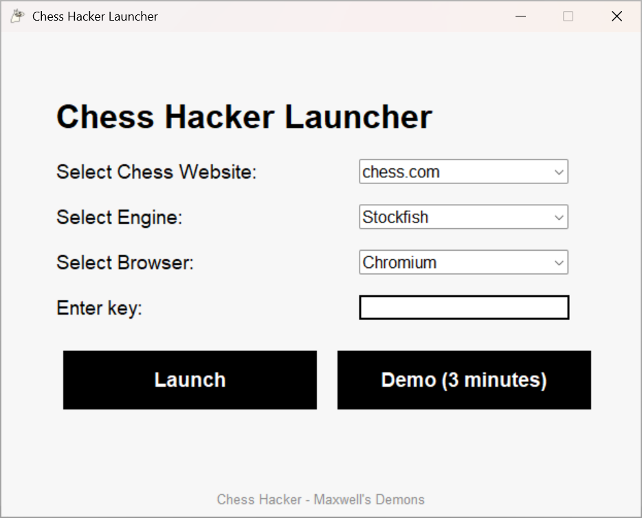

# Download ChessHacker
We're happy to see you want to try ChessHacker! To get started, simply download the client here [ZIP](https://github.com/Chess-Hacker/Chess-Hacker.github.io/releases/tag/v0.3.0-beta). You don't need to complete any sign-ups or make any payments, simply click on the Demo button and start playing. You can run the demo as many times as you want!

## How to Use
Guide article: [Link](/posts/guide/)

Using ChessHacker is simple! All you need to do in order to get it working is to **choose your color** and hit Start. ChessHacker also comes with many extra helpful features that you can learn as you keep using our app, and we hope they're intuitive to use! If you're ever confused about anything, check the tutorial above or write to us at our support email: chesshacker.maxwellsdemons@gmail.com

## Buying ChessHacker
Purchase article: [Link](/posts/purchase/)

If you've decided you want to play serious games with ChessHacker and the time limit is getting in your way, then you should buy a ChessHacker key. With a key, you can play with **no time limit**. We support PayPal and Kofi. Simply click on the link above to purchase.
