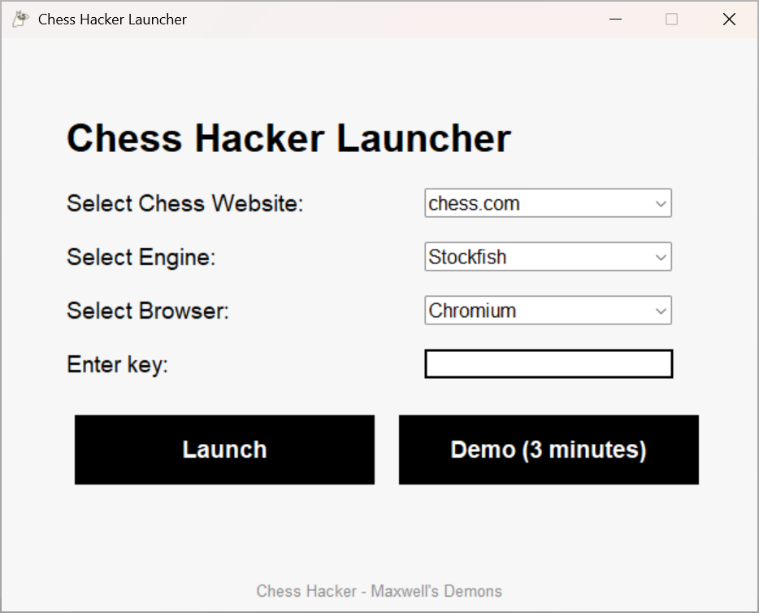
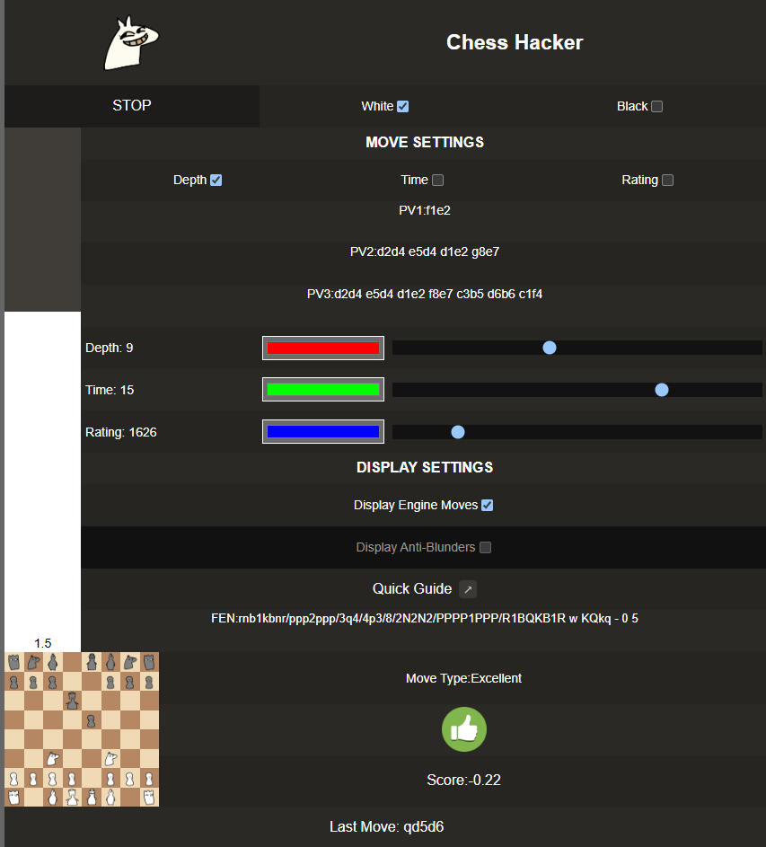
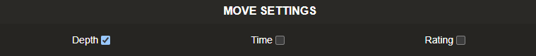
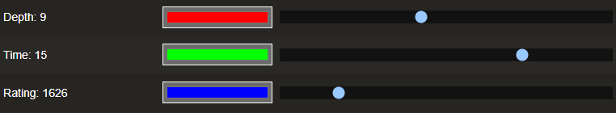
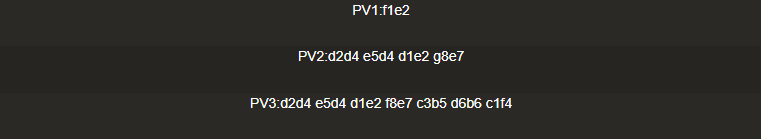
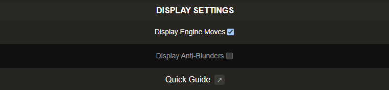
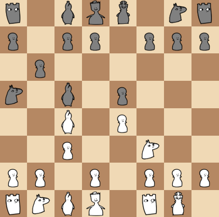
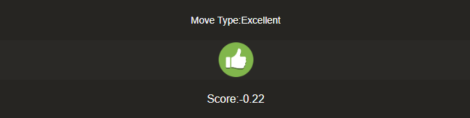

# Getting Ready with ChessHacker

Before you can start playing you will need to purchase a key.
1. Go to our [Kofi](https://ko-fi.com/s/f9e884d55a) page and buy a key.
2. Open the ChessHacker launcher.
3. In the "Enter key" field, paste the key you received by mail. Make sure you don't add any trailing whitespace!
4. Select the website you will be playing on, the chess engine that will be helping you and the browser you want to run the app in from the dropdown menus.
5. Click on Launch. If you do not have a key, you can click on Demo to try ChessHacker out, but the app will exit after 3 minutes.
6. You can now login on your chosen platform and start playing.

# ChessHacker UI Image

# Using ChessHacker in a game

To use ChessHacker in a game all you need to do is **select the pieces you are playing as** and click on Start. However you can tweak ChessHacker's behavior to your liking and achieve human-like play using the features below.
## Move settings

You can set ChessHacker to select your next move based on engine search depth, thinking time or rating. You can control these using the sliders. If you want to beat human opponents but not raise any flags you can try setting a small depth (4-5) which will be enough to prevent most blunders and select good moves but won't trip up the cheat detectors on chess websites, or you can let Stockfish play at a rating 50-100 points higher than your opponent's.

These parameters can be adjusted as you go! Check the evaluation bar on your left frequently. If you are dominating your opponent by a lot, you might want to tune down the settings a bit, ChessHacker will adjust automatically.

## Principal variations

You can see what Stockfish is thinking the best moves are (at certain depths) in the PV tabs. Usually if your opponent makes a move that deviates from these principal variations it means you have gained a little advantage and are closer to winning.
## Display settings

You can play with ChessHacker without the engine feeding your every move. Turn off Display Engine Moves if you want to play yourself. If you still want the peace of mind knowing you will not slip up make a major blunder you can turn on the Display Anti-Blunders setting which will tell you when you are about to make a mistake.

You can see how good your move is (as well as how much advantage you gained from it) in the bottom tab. With ChessHacker, you are guaranteed to get brilliants!

## Board display

In the bottom-left corner you can see what ChessHacker thinks the board looks like. There might be a little delay between you making your move and the board updating, however the ChessHacker and the actual board should usually be matching.

## FEN

FEN is a short string of text that represents a chess position completely. With ChessHacker you have access to the FEN of your game after every move, so you can copy it to your clipboard and share it with your friends or paste it somewhere to analyze the position later.

## Teacher

There is also a teacher mode that tells you when you do a good move or a bad move. This can help you improve at the game and make you understand certain positions better.